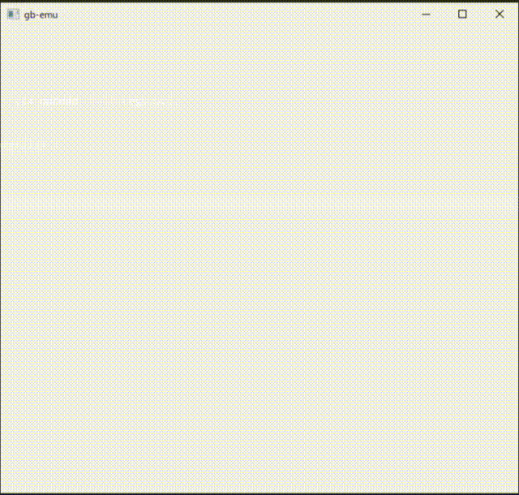

# GAME BOY Free Boot ROM



GAME BOYエミュレータ開発者のためのオープンソースのブートROMです．

このプロジェクトは[https://github.com/MiSTer-devel/Gameboy_MiSTer/](https://github.com/MiSTer-devel/Gameboy_MiSTer/)からライセンスを継承しています．

なるべく本物のブートROMに含まれる命令のみで作成することを目指すため，いくつかコードの変更を行いました．

## Supported boot ROM type

- [ ] DMG0
- [x] DMG
- [ ] MGB
- [ ] SGB
- [ ] SGB2
- [ ] CGB0
- [ ] CGB
- [ ] AGB0
- [ ] AGB

## How to build

ビルド済みのイメージを[Releases](https://github.com/take44444/Gameboy-free_bootrom/releases)で配布しています．イメージのみが必要な場合はそちらからダウンロードしてください．

自分でビルドする場合は以下のコマンドでビルドできます．

### DMG

```sh
rgbasm -h -o dmg_bootrom.o dmg_bootrom.asm
rgblink -x -o dmg_bootrom.bin dmg_bootrom.o
```
